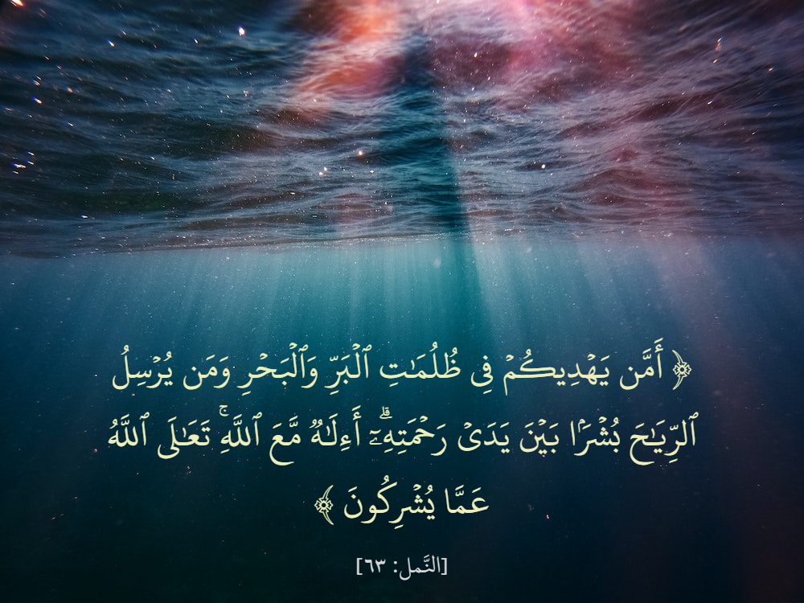
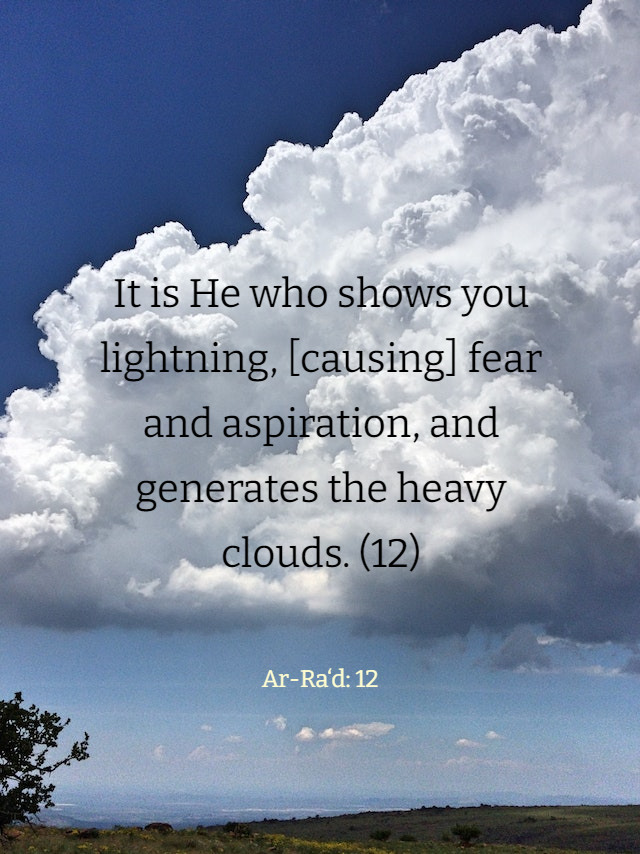
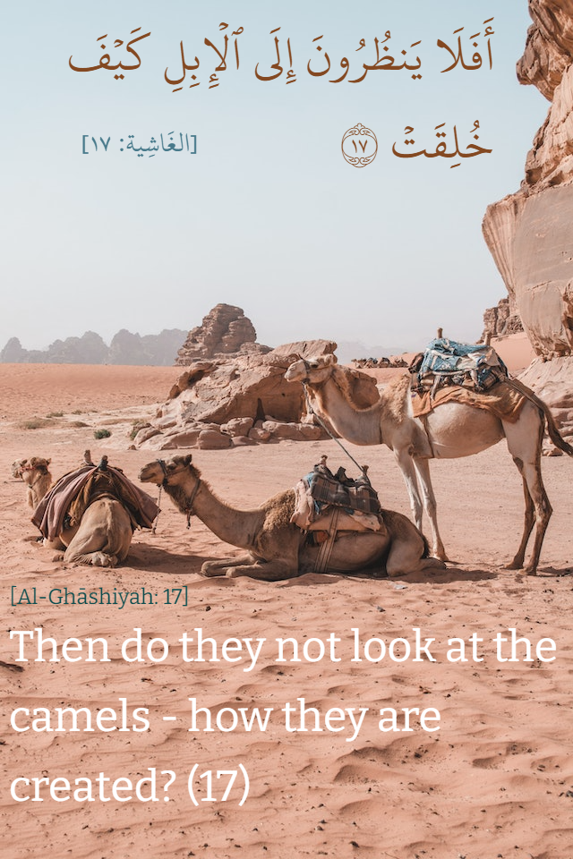

    

English version is available [here](README.md)

## تطبيق رُكن

رُكن هو أداة سهلة تسمح بإنشاء صور عالية الجودة تحتوي على آيات من القرآن الكريم و/أو ترجمة انجليزية. فهي تجعل مزج النصوص مع صورة خلفية (أو خلفية ذات لون موحد) مسألة بضع ضغطات زر! النصوص يمكن اعطائها أنماطا لتحصل على لون مخصص ومقاس يناسب التصميم المرغوب فيه كما يمكن جعلها متموقعة في المكان المطلوب.

## ويندوز

على الرغم من أن تطبيق الويب يمكن أن يستخدم على أي منصة، إلا أنه هناك نسخة WPF متوفرة [هنا](https://github.com/khiro95/rukn-app).

## إنشاء

يتطلب برنامج [Node.js](https://nodejs.org/) نسخة 14.15 أو أحدث.

## كيفية الاستخدام

### الخطوة 1: الخلفية

- اذا أردت استخدام صورة اضغط على زر **تحميل صورة** في اللوحة على اليمين وقم باختيارها. هذا سيعطي لوحة الرسم مقاسات تلقائية.
- اذا أردت استخدام خلفية ذات لون موحد، قم باختيار اللون المرغوب فيه من أداة انتقاء اللون في اللوحة على اليمين ثم أدخل مقاسات الطول والعرض المرغوب فيها.

### الخطوة 2: الآيات

- من اللوحة العلوية، قم باختيار السورة المطلوبة ثم قم باختيار رقم الآية المطلوبة.
- اذا أردت سلسلة من الآيات فقم بالضغط على مربع الاختيار بجانب حقل **إلى** ثم قم باختيار رقم الآية التي تتوقف عندها السلسلة.

### الخطوة 3: النصوص

- من اللوحة على اليسار، قم بتبديل ظهور النصوص عن طريق الضغط على العنصر الموافق.

*(**ملاحظة:** العناصر الموافقة لنصوص المراجع غير قابلة للضغط عليها)*

### الخطوة 4: النمط

- في منطقة الوسط قم بالضغط على نص ما من أجل تحديده، ثم استعمل اللوحة على اليمين لإضفاء الأنماط المطلوبة (اللون وحجم الخط والمحاذاة).
- بعض النصوص لديها أنماط خاصة. فعلى سبيل المثال النص العربي يدعم الأقواس المزخرفة. هذه الأنماط الخاصة يمكن ايجادها في اللوحة على اليمين.

### الخطوة 5: الموقع والمقاس

- استعمل الفأرة أو اللمس لسحب النص المحدد في منطقة الوسط. يمكن أيضا استعمال مفاتيح الأسهم في لوحة المفاتيح لتحريك النص المحدد، واصل الضغط على مفتاح <kbd>Shift</kbd> للتحريك بسرعة.
- استخدم مقابض مربع التحديد لتغيير مقاس صندوق النص. قم بضغط مزدوج على مربع التحديد لجعل الصندوق متناسب تماما مع طول النص.

*(**ملاحظة:** الضغط المزدوج على مربع التحديد يقوم فقط بإزالة المسافات الأفقية الزائدة)*

### الخطوة 6: حفظ

- عند الانتهاء اضغط على **حفظ** في اللوحة السفلية لحفظ الناتج كصورة بصيغة PNG.
- يمكن الضغط على **نسخ** من أجل نسخ الناتج كصورة بصيغة PNG إلى الحافظة.

*(**ملاحظة:** متصفح Firefox لا يدعم نسخ البيانات إلى الحافظة)*

## عينات

الصور التالية هي مثال على عمل تم بواسطة التطبيق:

## ملاحظات

- حاليا التطبيق يدعم فقط رواية حفص عن عاصم.
- التطبيق يستخدم الترجمة الانجليزية نسخة Saheeh International.

## عرفان

- [مجمع الملك فهد لطباعة المصحف الشريف](https://qurancomplex.gov.sa/): لتوفيره خط حفص إلى جانب النص الموافق له.
- [موسوعة القرآن الكريم](https://quranenc.com/): لتوفير الترجمة الانجليزية.
- [كليم](https://www.kaleam.com/): للمساعدة في تصميم الشعار (كلمة رُكن).